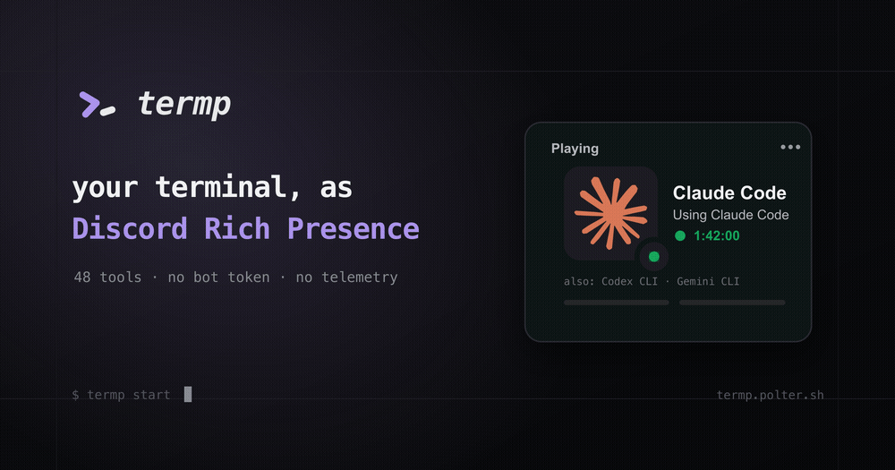

<p align="center">
  
</p>

<h1 align="center">Terminal Presence (<code>termp</code>)</h1>

> Let friends see what you are building, right from your Discord profile.

[](LICENSE)
[](go.mod)

`termp` shows the terminal tool you are using—Claude Code, Vim, lazygit, and
dozens more—as Discord Rich Presence. It runs quietly on your computer and
needs no Discord bot or token.

<p align="center">
  <a href="https://termp.polter.sh"></a>
</p>

## See it in about 30 seconds

There is not a published release yet, so for now you will need Go 1.24 or newer:

```sh
go install github.com/polter-dev/discord_terminal_presence/cmd/termp@latest
termp setup
termp start
```

Keep `termp start` running, open a supported tool such as `nvim`, `claude`, or
`lazygit`, and check your Discord profile. Discord's desktop app needs to be
running. To preview the card in your terminal instead, run `termp watch`.

The setup wizard creates your config, asks before enabling start-at-login, and
keeps folder names hidden unless you choose otherwise.

## Install

### From source — available now

```sh
go install github.com/polter-dev/discord_terminal_presence/cmd/termp@latest
```

This builds `termp` and puts it in your Go bin directory. If your shell cannot
find the command, make sure that directory is on your `PATH`.

### Packaged installs — coming at launch

There is no published GitHub release or Homebrew tap yet. Once the first release
is live, the project plans to offer Homebrew, a shell installer, and `.deb` and
`.rpm` packages. Until then, please use the source install above.

## Everyday commands

Running `termp` by itself in a terminal opens the live `watch` view.

| Command | What it does |
|---|---|
| `termp start` | Runs the presence service in the foreground, reloads config changes, and updates Discord. |
| `termp stop` | Stops the running service and cleans up its process-ID file. |
| `termp status` | Checks the service, Discord connection, start-at-login, config, warnings, and detected tool. |
| `termp watch` | Opens a live terminal preview. Use `--once` for one snapshot. |
| `termp install` | Enables start-at-login and starts termp using a macOS LaunchAgent or Linux systemd user service. |
| `termp uninstall` | Removes start-at-login. It does not remove the binary. |
| `termp enable` / `termp disable` | Resumes or pauses start-at-login without removing it. |
| `termp settings` | Opens the interactive settings menu. |
| `termp setup` | Runs first-time setup; without an interactive terminal, writes the default config and prints the next steps. |
| `termp config init` | Writes a commented sample config. Add `--force` to replace an existing config. |
| `termp completion <bash\|zsh\|fish>` | Prints a tab-completion script for your shell. |
| `termp version` | Prints the version, commit, build date, Go version, OS, and architecture. |
| `termp update` | Checks for a newer release and updates using Homebrew, Go, or the shell installer as appropriate. |

`termp watch`, `termp settings`, and the interactive setup wizard need a real
terminal window. Applying setup reconciles start-at-login in both directions: enabling it
installs autostart, disabling an existing setting removes autostart, and leaving it unchanged
does not run a service-manager operation.

Global flags:

| Flag | What it does |
|---|---|
| `--verbose`, `-v` | Prints extra log detail, for example `termp --verbose start`. |
| `--version` | Prints the version and exits. |

## Shell completion

Generate and install tab completion for your shell:

```sh
# bash
termp completion bash > ~/.local/share/bash-completion/completions/termp

# zsh
termp completion zsh > ${fpath[1]}/_termp

# fish
termp completion fish > ~/.config/fish/completions/termp.fish
```

To enable completion only for the current session, use
`source <(termp completion bash)` in bash, `source <(termp completion zsh)` in
zsh, or `termp completion fish | source` in fish. Each generated script starts
with these instructions as comments, so it remains safe to redirect to a file.

## Start automatically

Start-at-login is optional and works on macOS and Linux:

```sh
termp install     # install the login service and start it
termp disable     # pause it without removing it
termp enable      # resume it
termp uninstall   # remove the login service
```

On macOS, this creates
`~/Library/LaunchAgents/dev.termp.daemon.plist`, restarts termp after a crash,
and writes logs to `~/Library/Logs/termp.log`. On Linux, it creates
`~/.config/systemd/user/termp.service` and enables the systemd user service.

## Your privacy

`termp` has no telemetry and does no tracking. Presence details go only to the
Discord desktop app on your computer. There is no bot token: the built-in
Discord Application ID (`1523168764793847918`) is public, safe to share, and is
not a password or secret.

Your directory is hidden by default. If you opt in with
`show_directory = true`, you can restrict what appears with
`directory_allowlist`; `directory_basename_only = true` shows only the folder
name rather than its full path.

By default, `termp status` and `termp version` make an anonymous,
unauthenticated request to GitHub Releases at most once every 24 hours to look
for a newer version. The request contains no machine or install ID, usage data,
or config contents; its User-Agent is only `termp/<version>`.

To turn that check off, set the `NO_UPDATE_CHECK` environment variable (any
value, including an empty one) or add `update_check = false` to your config.
Either setting is enough.

## Updates

Run `termp update` to check for a newer release and update using the detected
install method. Homebrew installs use `brew upgrade`, source installs use
`go install ...@latest`, and shell/binary installs reuse the install script.
Automatic updates are opt-in with `auto_update = true`; they run silently when
`termp start` launches, never delay daemon startup, and take effect next start.

## Configuration

Your config lives at `~/.config/termp/config.toml`, or at
`$XDG_CONFIG_HOME/termp/config.toml` when `XDG_CONFIG_HOME` is set. `termp`
creates the directory when it starts and reloads changes automatically. If an
edit is invalid, it keeps the last good config; unknown settings appear as
warnings in `termp status`. When several valid saves happen before the daemon
handles a reload notification, they are coalesced so the newest config is
applied.

Presence and display settings hot-reload without restarting the daemon. This
includes `scan_interval`, `idle_clear_timeout`, `pin`,
`headliner_idle_timeout`, `activity_switching`, `custom_tools`, display and
privacy settings, CTA settings, and per-tool overrides. A changed scan interval
takes effect on the running scan ticker immediately. Reloading detector settings
preserves continuous process episodes (identified by tool, PID, and process
creation time), so elapsed timers do not restart for processes that remain
present.

Create a fully commented starter config with:

```sh
termp config init          # keep an existing config
termp config init --force  # replace an existing config
```

### Global options

| Key | Type | Default | Meaning |
|---|---|---|---|
| `enabled` | bool | `true` | Main on/off switch. When false, no presence is shown. |
| `update_check` | bool | `true` | Checks GitHub Releases in `termp status` and `termp version`; set false to disable. |
| `auto_update` | bool | `false` | Silently installs newer releases when `termp start` launches; the update takes effect next start. |
| `scan_interval` | duration | `"3s"` | How often termp scans running tools. Invalid or zero values fall back to 3 seconds. |
| `idle_clear_timeout` | duration | `"20m"` | Clears presence after all matched tools show no CPU activity for this long. Set `"0"` to disable; quiet work can appear idle. |
| `pin` | string | `""` | ID of a running tool that should always take the spotlight. |
| `headliner_idle_timeout` | duration | `"60s"` | How long the spotlighted tool must be idle before another can replace it. |
| `activity_switching` | bool | `true` | Allows a busier tool to take the spotlight after the current tool becomes idle. |

### Display options (`[display]`)

| Key | Type | Default | Meaning |
|---|---|---|---|
| `tool_name` | bool | `true` | Shows `Using <tool name>` on the detail line. |
| `elapsed_timer` | bool | `true` | Shows how long the tool has been running. |
| `small_image` | bool | `true` | Uses the top “also running” tool as the small icon. |
| `collection` | bool | `true` | Lists other running tools as `also: ...` when no folder is shown. |
| `buttons` | bool | `true` | Shows buttons on the presence; Discord allows at most two. |

### Privacy options (`[privacy]`)

| Key | Type | Default | Meaning |
|---|---|---|---|
| `show_directory` | bool | `false` | Shows the folder only when enabled and allowed. |
| `directory_allowlist` | string[] | `[]` | Allowed folders by path prefix (`~` works). Empty allows any folder. |
| `directory_basename_only` | bool | `true` | Shows the folder name instead of its full path. |

### Button options (`[cta]`)

| Key | Type | Default | Meaning |
|---|---|---|---|
| `enabled` | bool | `true` | Adds a termp button when fewer than two tool buttons are already visible. |
| `label` | string | `"What is this?"` | Text on the button. |
| `url` | string | `"https://termp.polter.sh/"` | Link opened by the button. |

### Per-tool overrides (`[tools.<id>]`)

For a specific tool ID, you can override `enabled`, `tool_name`,
`elapsed_timer`, `small_image`, `show_directory`, `directory_allowlist`,
`directory_basename_only`, and `buttons`. Buttons are a list of `{ label, url }`
pairs that replace that tool's defaults.

### Custom tools (`[[custom_tools]]`)

| Key | Type | Required | Meaning |
|---|---|---|---|
| `id` | string | yes | Tool ID. Reusing a built-in ID overrides it. |
| `display_name` | string | yes | Name shown in Discord. |
| `match.name` | string | one match | Exact program name, ignoring case. |
| `match.regex` | string | one match | Pattern matched against the program path and command line, ignoring case. |
| `exclude` | string | no | Pattern that rejects matching process paths or command lines, ignoring case. |
| `image_url` | string | one image | URL of an image to use. |
| `image_key` | string | one image | Key of an image uploaded to Discord. |
| `icon_slug` | string | one image | Logo name that termp looks up automatically. |
| `icon_source` | string | no | Logo source: `simpleicons` (default) or `lobehub`. |
| `priority` | int | no | Higher values win when several tools match. |
| `buttons` | array | no | Default buttons; only two reach Discord. |

Choose one image setting. If several are present, termp prefers `image_url`,
then `image_key`, then `icon_slug`.

### Example config

```toml
enabled = true
update_check = true
auto_update = false
scan_interval = "3s"
idle_clear_timeout = "20m"
pin = "codex-cli"
headliner_idle_timeout = "60s"
activity_switching = true

[display]
tool_name = true
elapsed_timer = true
small_image = true
collection = true
buttons = true

[privacy]
show_directory = false
directory_allowlist = ["~/dev", "~/work/oss"]
directory_basename_only = true

[tools.claude-code]
show_directory = true
directory_allowlist = ["~/dev/oss"]
buttons = [
  { label = "Claude Code", url = "https://claude.com/claude-code" },
]

[tools.gemini-cli]
enabled = false

[[custom_tools]]
id = "lazygit"
display_name = "lazygit"
match = { name = "lazygit" }
icon_slug = "lazygit"
icon_source = "simpleicons"
```

## Supported tools

`termp` recognizes 48 tools out of the box:

| Category | Tools |
|---|---|
| AI CLIs | Claude Code, Gemini CLI, Codex CLI, aider, Ollama |
| Editors | Neovim, Vim, Emacs, Helix, nano, micro, Kakoune |
| Multiplexers | tmux, Zellij, GNU Screen |
| Git | lazygit, GitUI, tig |
| Files | Yazi, ranger, nnn, lf, Midnight Commander, broot |
| Monitors | htop, btop, Glances, bottom, gtop, bpytop |
| Containers / K8s | k9s, lazydocker, ctop, kubectl tui |
| Disk & tasks | ncdu, gdu, Taskwarrior, calcurse |
| Messaging & media | NeoMutt, WeeChat, Irssi, cmus, ncmpcpp, spotify-tui, spotify_player |
| Network & utilities | gping, bandwhich, dust |

Need another one? Add it with `[[custom_tools]]`.

## How it works

`termp start` scans the processes running on your computer, matches them against
its built-in and custom tool list, and sends the chosen activity to the Discord
desktop app over Discord IPC. Nothing is sent to a termp server.

When several known tools are running, one takes the spotlight and up to three
more appear as `also: ...`. A busier tool can take over after the current one has
been idle for `headliner_idle_timeout`; set `pin = "<tool-id>"` to keep a
favorite in the spotlight whenever it is running.

## License

Released under the [MIT License](LICENSE).
